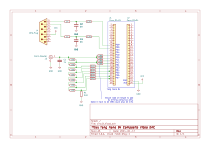

# FPGA Color Pong

This project aims to interpret the classic game of Pong in color using composite video. PAL, NTSC and SECAM can be used.
For input an Atari Paddle controller (1 MOhm Poti) is required.
The target plattform is the Tang Nano 9k but it should be portable to other plattforms as well.

This design is based on my [Composite Video Encoder](https://github.com/Slamy/fpga-composite-video) which handles the video generation.

## How to play

* Switch 2 of the Tang Nano will restart the game.
* Switch 1 cycles the supported video norms.
* Score 10 times to win the game.

## Schematic

## Screenshots and Photos

Example setup on a bread board.

### PAL

### NTSC

### SECAM

SECAM currently suffers under "SECAM fire". I'm not able to fix that at the moment.

